# Game Stats API - Entity Relationship Diagram

## Overview

This document defines the complete database schema for the Game Stats application, optimized for PostgreSQL 17 with pgvector extension. The schema is designed for high performance, scalability, and real-time analytics capabilities.

## Database Technology

- **DBMS**: PostgreSQL 17
- **ORM**: Ent (Go) - Schema-as-code approach
- **Extensions**: 
  - `pgvector` v0.8.1 - Vector similarity search for AI analytics
  - `uuid-ossp` - UUID generation
  - `pg_trgm` - Trigram matching for fuzzy search
- **Indexing Strategy**: B-tree, GIN, BRIN, and vector indexes

## Core Design Principles

1. **Normalization**: 3NF with strategic denormalization for performance
2. **Soft Deletes**: Use `deleted_at` timestamp instead of hard deletes
3. **Audit Fields**: All tables include `created_at`, `updated_at`, `created_by`, `updated_by`
4. **UUID Primary Keys**: For distributed systems and security
5. **Optimistic Locking**: Version fields for concurrent updates
6. **Partitioning**: Events and games partitioned by year for scalability

---

## Entity Relationship Diagram

```mermaid
erDiagram
    World ||--o{ Continent : contains
    Continent ||--o{ Country : contains
    Country ||--o{ Location : contains
    Country ||--o{ Discipline : regulates
    Location ||--o{ Field : has
    Discipline ||--o{ Event : organizes
    Event ||--o{ DivisionPool : divides_into
    Event ||--o{ EventReconciliation : participates_in
    DivisionPool ||--o{ Team : competes_in
    DivisionPool ||--o{ Game : hosts
    Location ||--o{ Team : home_of
    Team ||--o{ Player : has_member
    Team ||--o{ User : managed_by
    Game ||--o{ Scoring : records
    Game ||--o{ SpiritScore : evaluates
    Game ||--o{ GameEvent : tracks
    Player ||--o{ Scoring : achieves
    Player ||--o{ MVP_Nomination : receives
    Player ||--o{ SpiritNomination : receives
    GameRound ||--o{ Game : schedules
    User ||--o{ Game : officiates
    User ||--o{ SpiritScore : submits
    
    World {
        uuid id PK
        string name UK
        string slug UK
        text description
        timestamp created_at
        timestamp updated_at
        timestamp deleted_at
    }
    
    Continent {
        uuid id PK
        uuid world_id FK
        string name
        string slug UK
        text description
        timestamp created_at
        timestamp updated_at
        timestamp deleted_at
    }
    
    Country {
        uuid id PK
        uuid continent_id FK
        string name
        string slug UK
        string code
        text description
        timestamp created_at
        timestamp updated_at
        timestamp deleted_at
    }
    
    Location {
        uuid id PK
        uuid country_id FK
        string name
        string slug UK
        string address
        string city
        decimal latitude
        decimal longitude
        text description
        timestamp created_at
        timestamp updated_at
        timestamp deleted_at
    }
    
    Field {
        uuid id PK
        uuid location_id FK
        string name
        int capacity
        string surface_type
        jsonb metadata
        timestamp created_at
        timestamp updated_at
        timestamp deleted_at
    }
    
    Discipline {
        uuid id PK
        uuid country_id FK
        string name
        string slug UK
        text description
        text rules_pdf_url
        timestamp created_at
        timestamp updated_at
        timestamp deleted_at
    }
    
    Event {
        uuid id PK
        uuid discipline_id FK
        uuid location_id FK
        string name
        string slug UK
        int year
        date start_date
        date end_date
        string status
        text description
        jsonb settings
        timestamp created_at
        timestamp updated_at
        timestamp deleted_at
    }
    
    DivisionPool {
        uuid id PK
        uuid event_id FK
        string name
        string division_type
        int max_teams
        jsonb ranking_criteria
        text description
        timestamp created_at
        timestamp updated_at
        timestamp deleted_at
    }
    
    Team {
        uuid id PK
        uuid division_pool_id FK
        uuid home_location_id FK
        string name UK
        int initial_seed
        int final_placement
        string logo_url
        jsonb metadata
        timestamp created_at
        timestamp updated_at
        timestamp deleted_at
    }
    
    Player {
        uuid id PK
        uuid team_id FK
        string name
        string email
        string gender
        date date_of_birth
        string jersey_number
        string profile_image_url
        jsonb metadata
        timestamp created_at
        timestamp updated_at
        timestamp deleted_at
    }
    
    Game {
        uuid id PK
        uuid game_round_id FK
        uuid home_team_id FK
        uuid away_team_id FK
        uuid division_pool_id FK
        uuid field_id FK
        uuid scorekeeper_id FK
        string name UK
        timestamp scheduled_time
        timestamp actual_start_time
        timestamp actual_end_time
        int allocated_time_minutes
        int stoppage_time_seconds
        string status
        int home_team_score
        int away_team_score
        string first_pull_by
        int version
        jsonb metadata
        timestamp created_at
        timestamp updated_at
        timestamp deleted_at
    }
    
    GameRound {
        uuid id PK
        uuid event_id FK
        string name
        string round_type
        int round_number
        timestamp start_date
        timestamp end_date
        timestamp created_at
        timestamp updated_at
        timestamp deleted_at
    }
    
    Scoring {
        uuid id PK
        uuid game_id FK
        uuid player_id FK
        int goals
        int assists
        int blocks
        int turns
        int version
        timestamp created_at
        timestamp updated_at
        timestamp deleted_at
    }
    
    GameEvent {
        uuid id PK
        uuid game_id FK
        uuid player_id FK
        string event_type
        int minute
        int second
        string description
        jsonb metadata
        timestamp created_at
    }
    
    SpiritScore {
        uuid id PK
        uuid game_id FK
        uuid scored_by_team_id FK
        uuid team_id FK
        uuid submitted_by_user_id FK
        int rules_knowledge
        int fouls_body_contact
        int fair_mindedness
        int attitude
        int communication
        text comments
        timestamp created_at
        timestamp updated_at
        timestamp deleted_at
    }
    
    MVP_Nomination {
        uuid id PK
        uuid spirit_score_id FK
        uuid player_id FK
        string category
        timestamp created_at
    }
    
    SpiritNomination {
        uuid id PK
        uuid spirit_score_id FK
        uuid player_id FK
        string category
        timestamp created_at
    }
    
    EventReconciliation {
        uuid id PK
        string name
        text description
        bool is_active
        timestamp created_at
        timestamp updated_at
    }
    
    User {
        uuid id PK
        string email UK
        string password_hash
        string full_name
        string role
        uuid managed_continent_id FK
        uuid managed_country_id FK
        uuid managed_discipline_id FK
        uuid managed_event_id FK
        uuid managed_team_id FK
        bool is_active
        timestamp last_login_at
        timestamp created_at
        timestamp updated_at
        timestamp deleted_at
    }
```



---

## Table Definitions

### Geographic Hierarchy

#### World
**Purpose**: Top-level geographic container

| Column | Type | Constraints | Description |
|--------|------|-------------|-------------|
| id | UUID | PK | Primary key |
| name | VARCHAR(100) | NOT NULL, UNIQUE | World region name |
| slug | VARCHAR(100) | NOT NULL, UNIQUE | URL-friendly identifier |
| description | TEXT | | Additional information |
| created_at | TIMESTAMP | NOT NULL, DEFAULT now() | Creation timestamp |
| updated_at | TIMESTAMP | NOT NULL, DEFAULT now() | Last update timestamp |
| deleted_at | TIMESTAMP | | Soft delete timestamp |

**Indexes**:
- PRIMARY KEY (id)
- UNIQUE INDEX (name)
- UNIQUE INDEX (slug)
- INDEX (deleted_at) WHERE deleted_at IS NULL

---

#### Continent
**Purpose**: Continental divisions

| Column | Type | Constraints | Description |
|--------|------|-------------|-------------|
| id | UUID | PK | Primary key |
| world_id | UUID | FK → World, NOT NULL | Parent world |
| name | VARCHAR(100) | NOT NULL | Continent name |
| slug | VARCHAR(100) | NOT NULL, UNIQUE | URL-friendly identifier |
| description | TEXT | | Additional information |
| created_at | TIMESTAMP | NOT NULL | Creation timestamp |
| updated_at | TIMESTAMP | NOT NULL | Last update timestamp |
| deleted_at | TIMESTAMP | | Soft delete timestamp |

**Indexes**:
- PRIMARY KEY (id)
- FOREIGN KEY (world_id) REFERENCES World(id)
- INDEX (world_id, deleted_at)
- UNIQUE INDEX (slug)

---

#### Country
**Purpose**: National boundaries

| Column | Type | Constraints | Description |
|--------|------|-------------|-------------|
| id | UUID | PK | Primary key |
| continent_id | UUID | FK → Continent, NOT NULL | Parent continent |
| name | VARCHAR(100) | NOT NULL | Country name |
| slug | VARCHAR(100) | NOT NULL, UNIQUE | URL-friendly identifier |
| code | VARCHAR(3) | NOT NULL, UNIQUE | ISO 3166-1 alpha-3 code |
| description | TEXT | | Additional information |
| created_at | TIMESTAMP | NOT NULL | Creation timestamp |
| updated_at | TIMESTAMP | NOT NULL | Last update timestamp |
| deleted_at | TIMESTAMP | | Soft delete timestamp |

**Indexes**:
- PRIMARY KEY (id)
- FOREIGN KEY (continent_id) REFERENCES Continent(id)
- INDEX (continent_id, deleted_at)
- UNIQUE INDEX (slug)
- UNIQUE INDEX (code)

---

#### Location
**Purpose**: Specific venues or cities

| Column | Type | Constraints | Description |
|--------|------|-------------|-------------|
| id | UUID | PK | Primary key |
| country_id | UUID | FK → Country, NOT NULL | Parent country |
| name | VARCHAR(200) | NOT NULL | Location name |
| slug | VARCHAR(200) | NOT NULL, UNIQUE | URL-friendly identifier |
| address | VARCHAR(500) | | Physical address |
| city | VARCHAR(100) | | City name |
| latitude | DECIMAL(10, 8) | | GPS latitude |
| longitude | DECIMAL(11, 8) | | GPS longitude |
| description | TEXT | | Additional information |
| created_at | TIMESTAMP | NOT NULL | Creation timestamp |
| updated_at | TIMESTAMP | NOT NULL | Last update timestamp |
| deleted_at | TIMESTAMP | | Soft delete timestamp |

**Indexes**:
- PRIMARY KEY (id)
- FOREIGN KEY (country_id) REFERENCES Country(id)
- INDEX (country_id, city, deleted_at)
- INDEX USING GIST (latitude, longitude) - Spatial queries
- UNIQUE INDEX (slug)

---

#### Field
**Purpose**: Specific playing fields

| Column | Type | Constraints | Description |
|--------|------|-------------|-------------|
| id | UUID | PK | Primary key |
| location_id | UUID | FK → Location, NOT NULL | Parent location |
| name | VARCHAR(100) | NOT NULL | Field name/number |
| capacity | INTEGER | | Spectator capacity |
| surface_type | VARCHAR(50) | | e.g., "grass", "turf", "sand" |
| metadata | JSONB | | Additional field properties |
| created_at | TIMESTAMP | NOT NULL | Creation timestamp |
| updated_at | TIMESTAMP | NOT NULL | Last update timestamp |
| deleted_at | TIMESTAMP | | Soft delete timestamp |

**Indexes**:
- PRIMARY KEY (id)
- FOREIGN KEY (location_id) REFERENCES Location(id)
- INDEX (location_id, deleted_at)
- GIN INDEX (metadata)

---

### Event Management

#### Discipline
**Purpose**: Sport types and governing bodies

| Column | Type | Constraints | Description |
|--------|------|-------------|-------------|
| id | UUID | PK | Primary key |
| country_id | UUID | FK → Country, NOT NULL | Governing country |
| name | VARCHAR(100) | NOT NULL | Discipline name |
| slug | VARCHAR(100) | NOT NULL, UNIQUE | URL-friendly identifier |
| description | TEXT | | Discipline description |
| rules_pdf_url | TEXT | | Link to official rules |
| created_at | TIMESTAMP | NOT NULL | Creation timestamp |
| updated_at | TIMESTAMP | NOT NULL | Last update timestamp |
| deleted_at | TIMESTAMP | | Soft delete timestamp |

**Indexes**:
- PRIMARY KEY (id)
- FOREIGN KEY (country_id) REFERENCES Country(id)
- INDEX (country_id, deleted_at)
- UNIQUE INDEX (slug)

---

#### Event
**Purpose**: Tournaments and competitions
**Partitioning**: PARTITION BY RANGE (year)

| Column | Type | Constraints | Description |
|--------|------|-------------|-------------|
| id | UUID | PK | Primary key |
| discipline_id | UUID | FK → Discipline, NOT NULL | Sport discipline |
| location_id | UUID | FK → Location, NOT NULL | Event location |
| name | VARCHAR(200) | NOT NULL | Event name |
| slug | VARCHAR(200) | NOT NULL, UNIQUE | URL-friendly identifier |
| year | INTEGER | NOT NULL | Event year (partition key) |
| start_date | DATE | NOT NULL | Event start date |
| end_date | DATE | NOT NULL | Event end date |
| status | VARCHAR(20) | NOT NULL, DEFAULT 'draft' | draft, active, completed, canceled |
| description | TEXT | | Event description |
| settings | JSONB | | Event-specific configuration |
| created_at | TIMESTAMP | NOT NULL | Creation timestamp |
| updated_at | TIMESTAMP | NOT NULL | Last update timestamp |
| deleted_at | TIMESTAMP | | Soft delete timestamp |

**Indexes**:
- PRIMARY KEY (id, year)
- FOREIGN KEY (discipline_id) REFERENCES Discipline(id)
- FOREIGN KEY (location_id) REFERENCES Location(id)
- INDEX (discipline_id, year, status, deleted_at)
- INDEX (year, start_date, end_date)
- UNIQUE INDEX (slug)
- GIN INDEX (settings)

**Partition Strategy**:
```sql
-- Create partitions for each year
CREATE TABLE events_2024 PARTITION OF events FOR VALUES FROM (2024) TO (2025);
CREATE TABLE events_2025 PARTITION OF events FOR VALUES FROM (2025) TO (2026);
CREATE TABLE events_2026 PARTITION OF events FOR VALUES FROM (2026) TO (2027);
-- Future partitions created annually
```

---

#### DivisionPool
**Purpose**: Divisions or pools within events

| Column | Type | Constraints | Description |
|--------|------|-------------|-------------|
| id | UUID | PK | Primary key |
| event_id | UUID | FK → Event, NOT NULL | Parent event |
| name | VARCHAR(100) | NOT NULL | Division/pool name |
| division_type | VARCHAR(50) | NOT NULL | e.g., "mixed", "open", "women" |
| max_teams | INTEGER | | Maximum team capacity |
| ranking_criteria | JSONB | | Auto-ranking rules |
| description | TEXT | | Division description |
| created_at | TIMESTAMP | NOT NULL | Creation timestamp |
| updated_at | TIMESTAMP | NOT NULL | Last update timestamp |
| deleted_at | TIMESTAMP | | Soft delete timestamp |

**Indexes**:
- PRIMARY KEY (id)
- FOREIGN KEY (event_id) REFERENCES Event(id)
- INDEX (event_id, division_type, deleted_at)
- UNIQUE (event_id, name) WHERE deleted_at IS NULL
- GIN INDEX (ranking_criteria)

---

### Team & Player Management

#### Team
**Purpose**: Participating teams

| Column | Type | Constraints | Description |
|--------|------|-------------|-------------|
| id | UUID | PK | Primary key |
| division_pool_id | UUID | FK → DivisionPool, NOT NULL | Competing division |
| home_location_id | UUID | FK → Location | Team's home location |
| name | VARCHAR(100) | NOT NULL, UNIQUE | Team name |
| initial_seed | INTEGER | | Tournament seeding |
| final_placement | INTEGER | | Final tournament rank |
| logo_url | TEXT | | Team logo URL |
| metadata | JSONB | | Additional team data |
| created_at | TIMESTAMP | NOT NULL | Creation timestamp |
| updated_at | TIMESTAMP | NOT NULL | Last update timestamp |
| deleted_at | TIMESTAMP | | Soft delete timestamp |

**Indexes**:
- PRIMARY KEY (id)
- FOREIGN KEY (division_pool_id) REFERENCES DivisionPool(id)
- FOREIGN KEY (home_location_id) REFERENCES Location(id)
- INDEX (division_pool_id, initial_seed, deleted_at)
- UNIQUE INDEX (name) WHERE deleted_at IS NULL
- GIN INDEX (metadata)

---

#### Player
**Purpose**: Individual athletes

| Column | Type | Constraints | Description |
|--------|------|-------------|-------------|
| id | UUID | PK | Primary key |
| team_id | UUID | FK → Team, NOT NULL | Player's team |
| name | VARCHAR(200) | NOT NULL | Player full name |
| email | VARCHAR(255) | | Contact email |
| gender | VARCHAR(10) | NOT NULL | M, F, O |
| date_of_birth | DATE | | Birthdate |
| jersey_number | VARCHAR(10) | | Jersey number |
| profile_image_url | TEXT | | Profile photo URL |
| metadata | JSONB | | Additional player data |
| created_at | TIMESTAMP | NOT NULL | Creation timestamp |
| updated_at | TIMESTAMP | NOT NULL | Last update timestamp |
| deleted_at | TIMESTAMP | | Soft delete timestamp |

**Indexes**:
- PRIMARY KEY (id)
- FOREIGN KEY (team_id) REFERENCES Team(id)
- INDEX (team_id, gender, deleted_at)
- INDEX (name) USING gin (name gin_trgm_ops) - Fuzzy search
- UNIQUE (team_id, jersey_number) WHERE deleted_at IS NULL

---

### Game Management

#### GameRound
**Purpose**: Tournament rounds/stages

| Column | Type | Constraints | Description |
|--------|------|-------------|-------------|
| id | UUID | PK | Primary key |
| event_id | UUID | FK → Event, NOT NULL | Parent event |
| name | VARCHAR(100) | NOT NULL | Round name |
| round_type | VARCHAR(50) | NOT NULL | pool, bracket, final |
| round_number | INTEGER | | Sequential ordering |
| start_date | TIMESTAMP | | Round start |
| end_date | TIMESTAMP | | Round end |
| created_at | TIMESTAMP | NOT NULL | Creation timestamp |
| updated_at | TIMESTAMP | NOT NULL | Last update timestamp |
| deleted_at | TIMESTAMP | | Soft delete timestamp |

**Indexes**:
- PRIMARY KEY (id)
- FOREIGN KEY (event_id) REFERENCES Event(id)
- INDEX (event_id, round_number, deleted_at)
- UNIQUE (event_id, name) WHERE deleted_at IS NULL

---

#### Game
**Purpose**: Individual matches
**Partitioning**: PARTITION BY RANGE (scheduled_time) - Yearly partitions

| Column | Type | Constraints | Description |
|--------|------|-------------|-------------|
| id | UUID | PK | Primary key |
| game_round_id | UUID | FK → GameRound | Tournament round |
| home_team_id | UUID | FK → Team, NOT NULL | Home team |
| away_team_id | UUID | FK → Team, NOT NULL | Away team |
| division_pool_id | UUID | FK → DivisionPool, NOT NULL | Division/pool |
| field_id | UUID | FK → Field, NOT NULL | Playing field |
| scorekeeper_id | UUID | FK → User | Assigned scorekeeper |
| name | VARCHAR(100) | NOT NULL, UNIQUE | Game identifier |
| scheduled_time | TIMESTAMP | NOT NULL | Scheduled start (partition key) |
| actual_start_time | TIMESTAMP | | Actual start time |
| actual_end_time | TIMESTAMP | | Actual end time |
| allocated_time_minutes | INTEGER | NOT NULL | Game duration |
| stoppage_time_seconds | INTEGER | DEFAULT 0 | Total stoppage time |
| status | VARCHAR(20) | NOT NULL, DEFAULT 'scheduled' | scheduled, in_progress, finished, ended, canceled |
| home_team_score | INTEGER | DEFAULT 0 | Home team final score |
| away_team_score | INTEGER | DEFAULT 0 | Away team final score |
| first_pull_by | VARCHAR(10) | | home or away |
| version | INTEGER | DEFAULT 1 | Optimistic locking |
| metadata | JSONB | | Additional game data |
| created_at | TIMESTAMP | NOT NULL | Creation timestamp |
| updated_at | TIMESTAMP | NOT NULL | Last update timestamp |
| deleted_at | TIMESTAMP | | Soft delete timestamp |

**Indexes**:
- PRIMARY KEY (id, scheduled_time)
- FOREIGN KEY (game_round_id) REFERENCES GameRound(id)
- FOREIGN KEY (home_team_id) REFERENCES Team(id)
- FOREIGN KEY (away_team_id) REFERENCES Team(id)
- FOREIGN KEY (division_pool_id) REFERENCES DivisionPool(id)
- FOREIGN KEY (field_id) REFERENCES Field(id)
- FOREIGN KEY (scorekeeper_id) REFERENCES User(id)
- INDEX (division_pool_id, scheduled_time, status, deleted_at)
- INDEX (field_id, scheduled_time)
- INDEX (status, scheduled_time) - Real-time queries
- UNIQUE INDEX (name) WHERE deleted_at IS NULL
- GIN INDEX (metadata)

**Partition Strategy**: Similar to Events table, partitioned by year

---

#### GameEvent
**Purpose**: Timeline of game events (goals, stoppages, etc.)

| Column | Type | Constraints | Description |
|--------|------|-------------|-------------|
| id | UUID | PK | Primary key |
| game_id | UUID | FK → Game, NOT NULL | Related game |
| player_id | UUID | FK → Player | Player involved (null for stoppages) |
| event_type | VARCHAR(50) | NOT NULL | goal, assist, block, turnover, stoppage |
| minute | INTEGER | NOT NULL | Event minute |
| second | INTEGER | NOT NULL | Event second |
| description | TEXT | | Event details |
| metadata | JSONB | | Additional event data |
| created_at | TIMESTAMP | NOT NULL | Creation timestamp |

**Indexes**:
- PRIMARY KEY (id)
- FOREIGN KEY (game_id) REFERENCES Game(id)
- FOREIGN KEY (player_id) REFERENCES Player(id)
- INDEX (game_id, minute, second) - Timeline queries
- INDEX (player_id, event_type) - Player stats
- GIN INDEX (metadata)

---

#### Scoring
**Purpose**: Player statistics per game

| Column | Type | Constraints | Description |
|--------|------|-------------|-------------|
| id | UUID | PK | Primary key |
| game_id | UUID | FK → Game, NOT NULL | Related game |
| player_id | UUID | FK → Player, NOT NULL | Player |
| goals | INTEGER | DEFAULT 0 | Goals scored |
| assists | INTEGER | DEFAULT 0 | Assists made |
| blocks | INTEGER | DEFAULT 0 | Blocks made |
| turns | INTEGER | DEFAULT 0 | Turnovers |
| version | INTEGER | DEFAULT 1 | Optimistic locking |
| created_at | TIMESTAMP | NOT NULL | Creation timestamp |
| updated_at | TIMESTAMP | NOT NULL | Last update timestamp |
| deleted_at | TIMESTAMP | | Soft delete timestamp |

**Indexes**:
- PRIMARY KEY (id)
- FOREIGN KEY (game_id) REFERENCES Game(id)
- FOREIGN KEY (player_id) REFERENCES Player(id)
- UNIQUE (game_id, player_id) WHERE deleted_at IS NULL
- INDEX (player_id, goals DESC, assists DESC) - Leaderboards

---

### Spirit Scores & Nominations

#### SpiritScore
**Purpose**: Spirit of the Game evaluation

| Column | Type | Constraints | Description |
|--------|------|-------------|-------------|
| id | UUID | PK | Primary key |
| game_id | UUID | FK → Game, NOT NULL | Related game |
| scored_by_team_id | UUID | FK → Team, NOT NULL | Team giving score |
| team_id | UUID | FK → Team, NOT NULL | Team being scored |
| submitted_by_user_id | UUID | FK → User, NOT NULL | Submitter |
| rules_knowledge | INTEGER | NOT NULL, CHECK (0-4) | Rules understanding |
| fouls_body_contact | INTEGER | NOT NULL, CHECK (0-4) | Contact behavior |
| fair_mindedness | INTEGER | NOT NULL, CHECK (0-4) | Fairness |
| attitude | INTEGER | NOT NULL, CHECK (0-4) | Positive attitude |
| communication | INTEGER | NOT NULL, CHECK (0-4) | Communication quality |
| comments | TEXT | | Additional feedback |
| created_at | TIMESTAMP | NOT NULL | Creation timestamp |
| updated_at | TIMESTAMP | NOT NULL | Last update timestamp |
| deleted_at | TIMESTAMP | | Soft delete timestamp |

**Indexes**:
- PRIMARY KEY (id)
- FOREIGN KEY (game_id) REFERENCES Game(id)
- FOREIGN KEY (scored_by_team_id) REFERENCES Team(id)
- FOREIGN KEY (team_id) REFERENCES Team(id)
- FOREIGN KEY (submitted_by_user_id) REFERENCES User(id)
- UNIQUE (game_id, scored_by_team_id, team_id) WHERE deleted_at IS NULL
- INDEX (team_id) - Aggregate queries

---

#### MVP_Nomination
**Purpose**: Most Valuable Player nominations

| Column | Type | Constraints | Description |
|--------|------|-------------|-------------|
| id | UUID | PK | Primary key |
| spirit_score_id | UUID | FK → SpiritScore, NOT NULL | Related spirit score |
| player_id | UUID | FK → Player, NOT NULL | Nominated player |
| category | VARCHAR(20) | NOT NULL | male or female |
| created_at | TIMESTAMP | NOT NULL | Creation timestamp |

**Indexes**:
- PRIMARY KEY (id)
- FOREIGN KEY (spirit_score_id) REFERENCES SpiritScore(id)
- FOREIGN KEY (player_id) REFERENCES Player(id)
- INDEX (player_id, category) - Nomination counts

---

#### SpiritNomination
**Purpose**: Spirit award nominations

| Column | Type | Constraints | Description |
|--------|------|-------------|-------------|
| id | UUID | PK | Primary key |
| spirit_score_id | UUID | FK → SpiritScore, NOT NULL | Related spirit score |
| player_id | UUID | FK → Player, NOT NULL | Nominated player |
| category | VARCHAR(20) | NOT NULL | male or female |
| created_at | TIMESTAMP | NOT NULL | Creation timestamp |

**Indexes**:
- PRIMARY KEY (id)
- FOREIGN KEY (spirit_score_id) REFERENCES SpiritScore(id)
- FOREIGN KEY (player_id) REFERENCES Player(id)
- INDEX (player_id, category) - Nomination counts

---

### User Management

#### User
**Purpose**: System users and authentication

| Column | Type | Constraints | Description |
|--------|------|-------------|-------------|
| id | UUID | PK | Primary key |
| email | VARCHAR(255) | NOT NULL, UNIQUE | Login email |
| password_hash | VARCHAR(255) | NOT NULL | Hashed password |
| full_name | VARCHAR(200) | NOT NULL | User's name |
| role | VARCHAR(50) | NOT NULL | admin, continent_manager, country_manager, discipline_manager, event_manager, team_manager, scorekeeper, spectator |
| managed_continent_id | UUID | FK → Continent | For continent managers |
| managed_country_id | UUID | FK → Country | For country managers |
| managed_discipline_id | UUID | FK → Discipline | For discipline managers |
| managed_event_id | UUID | FK → Event | For event managers |
| managed_team_id | UUID | FK → Team | For team managers |
| is_active | BOOLEAN | DEFAULT true | Account status |
| last_login_at | TIMESTAMP | | Last login timestamp |
| created_at | TIMESTAMP | NOT NULL | Creation timestamp |
| updated_at | TIMESTAMP | NOT NULL | Last update timestamp |
| deleted_at | TIMESTAMP | | Soft delete timestamp |

**Indexes**:
- PRIMARY KEY (id)
- UNIQUE INDEX (email) WHERE deleted_at IS NULL
- INDEX (role, is_active, deleted_at)
- FOREIGN KEY (managed_continent_id) REFERENCES Continent(id)
- FOREIGN KEY (managed_country_id) REFERENCES Country(id)
- FOREIGN KEY (managed_discipline_id) REFERENCES Discipline(id)
- FOREIGN KEY (managed_event_id) REFERENCES Event(id)
- FOREIGN KEY (managed_team_id) REFERENCES Team(id)

---

#### EventReconciliation
**Purpose**: Merging statistics across related events

| Column | Type | Constraints | Description |
|--------|------|-------------|-------------|
| id | UUID | PK | Primary key |
| name | VARCHAR(200) | NOT NULL | Reconciliation name |
| description | TEXT | | Purpose description |
| is_active | BOOLEAN | DEFAULT true | Active status |
| created_at | TIMESTAMP | NOT NULL | Creation timestamp |
| updated_at | TIMESTAMP | NOT NULL | Last update timestamp |

**Junction Table: event_reconciliation_events**

| Column | Type | Constraints |
|--------|------|-------------|
| reconciliation_id | UUID | FK → EventReconciliation |
| event_id | UUID | FK → Event |
| PRIMARY KEY (reconciliation_id, event_id) |

---

## Vector Embeddings for AI Analytics

### Analytics Embeddings Table

**Purpose**: Store vector embeddings for natural language analytics queries

| Column | Type | Constraints | Description |
|--------|------|-------------|-------------|
| id | UUID | PK | Primary key |
| entity_type | VARCHAR(50) | NOT NULL | player, team, game, event |
| entity_id | UUID | NOT NULL | Foreign key to entity |
| embedding | VECTOR(1536) | NOT NULL | OpenAI ada-002 embedding |
| content | TEXT | NOT NULL | Original text content |
| metadata | JSONB | | Additional context |
| created_at | TIMESTAMP | NOT NULL | Creation timestamp |
| updated_at | TIMESTAMP | NOT NULL | Last update timestamp |

**Indexes**:
- PRIMARY KEY (id)
- INDEX USING ivfflat (embedding vector_cosine_ops) WITH (lists = 100) - Vector similarity search
- INDEX (entity_type, entity_id)
- GIN INDEX (metadata)

---

## Migration Strategy

### From Django to Ent

1. **Schema Export**: Use Django's `dumpdata` to export existing data
2. **Ent Schema Generation**: Define Ent schemas matching Django models
3. **Data Transformation**: Write migration scripts to map Django data to new schema
4. **UUID Migration**: Generate UUIDs for all existing integer IDs
5. **Validation**: Compare record counts and relationships
6. **Cutover**: Blue-green deployment strategy

### Migration Checklist

- [ ] Backup Django database
- [ ] Create PostgreSQL 17 database with extensions
- [ ] Generate Ent schemas
- [ ] Run Ent migrations to create tables
- [ ] Export Django data to JSON
- [ ] Transform and import data
- [ ] Validate data integrity
- [ ] Test application with new database
- [ ] Deploy and monitor

---

## Performance Optimizations

### Materialized Views

**Team Statistics View**:
```sql
CREATE MATERIALIZED VIEW team_stats AS
SELECT 
    t.id,
    t.name,
    COUNT(DISTINCT g.id) FILTER (WHERE g.status = 'ended') as games_played,
    COUNT(*) FILTER (WHERE g.home_team_id = t.id AND g.home_team_score > g.away_team_score 
                      OR g.away_team_id = t.id AND g.away_team_score > g.home_team_score) as wins,
    SUM(CASE WHEN g.home_team_id = t.id THEN g.home_team_score ELSE g.away_team_score END) as goals_for,
    SUM(CASE WHEN g.home_team_id = t.id THEN g.away_team_score ELSE g.home_team_score END) as goals_against,
    AVG(ss.rules_knowledge + ss.fouls_body_contact + ss.fair_mindedness + ss.attitude + ss.communication) as spirit_avg
FROM teams t
LEFT JOIN games g ON (g.home_team_id = t.id OR g.away_team_id = t.id) AND g.deleted_at IS NULL
LEFT JOIN spirit_scores ss ON ss.team_id = t.id AND ss.deleted_at IS NULL
WHERE t.deleted_at IS NULL
GROUP BY t.id, t.name;

CREATE UNIQUE INDEX ON team_stats (id);
REFRESH MATERIALIZED VIEW CONCURRENTLY team_stats;
```

**Player Statistics View**:
```sql
CREATE MATERIALIZED VIEW player_stats AS
SELECT 
    p.id,
    p.name,
    p.team_id,
    p.gender,
    SUM(s.goals) as total_goals,
    SUM(s.assists) as total_assists,
    SUM(s.blocks) as total_blocks,
    COUNT(DISTINCT s.game_id) as games_played,
    COUNT(mvp.id) as mvp_nominations,
    COUNT(sn.id) as spirit_nominations
FROM players p
LEFT JOIN scoring s ON s.player_id = p.id AND s.deleted_at IS NULL
LEFT JOIN mvp_nominations mvp ON mvp.player_id = p.id
LEFT JOIN spirit_nominations sn ON sn.player_id = p.id
WHERE p.deleted_at IS NULL
GROUP BY p.id, p.name, p.team_id, p.gender;

CREATE UNIQUE INDEX ON player_stats (id);
REFRESH MATERIALIZED VIEW CONCURRENTLY player_stats;
```

### Caching Strategy

**Redis Cache Keys**:
- `game:{id}:live` - Live game data (30s TTL)
- `team:{id}:stats` - Team statistics (5min TTL)
- `player:{id}:stats` - Player statistics (5min TTL)
- `event:{id}:standings` - Event standings (1min TTL)
- `division:{id}:bracket` - Tournament bracket (1min TTL)

### Query Optimization

1. **Use Prepared Statements**: Reduce parsing overhead
2. **Connection Pooling**: PgBouncer with 100 connections
3. **Read Replicas**: Route read queries to replicas
4. **Partitioning**: Automatic partition creation for Events and Games
5. **Index-Only Scans**: Covering indexes for common queries

---

## Backup and Recovery

- **Continuous Archiving**: WAL archiving to S3
- **Point-in-Time Recovery**: Enabled
- **Automated Backups**: Daily full backup + continuous WAL
- **Retention**: 30 days for PITR, 1 year for monthly backups
- **Disaster Recovery**: Cross-region replication

---

## Security Considerations

1. **Row-Level Security (RLS)**: Enforce permissions at database level
2. **Encryption**: TLS for connections, encryption at rest
3. **Audit Logging**: Track all DML operations
4. **Principle of Least Privilege**: Application user has limited permissions
5. **Password Policies**: Enforce strong passwords, rotation
6. **SQL Injection Prevention**: Parameterized queries only

---

## Conclusion

This ERD provides a comprehensive, scalable, and performant database schema for the Game Stats application. The design addresses all identified gaps from the Django implementation while incorporating modern best practices and optimization strategies.
